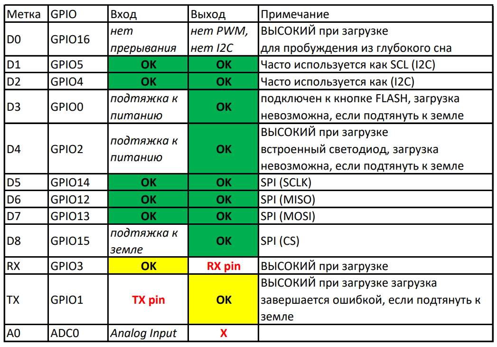

# Пины NodeMCU v1.0

[ESP8266 12-E NodeMCU Kit PIN OUT](https://dzen.ru/a/YnlmdtTsDRVCwOG4)

Проект NodeMCU представляет собой набор аппаратного и программного обеспечения, а платы NodeMCU изначально предназначались для работы на языке программирования LUA. Удобно, что платы можно использовать с Arduino IDE и программировать так же, как и другие платы Arduino. При программировании через Arduino IDE можно считать, что плата NodeMCU — это Arduino с чуть меньшим количеством контактов и встроенным Wi-Fi. Однако следует обратить внимание на назначение контактов. Оно немного отличается от Arduino. На плате NodeMCU есть два набора контактов: GPIO-контакты ESP8266 и D-контакты платы.

Если вы используете пин-код, например:

`int LED_Pin = 1`;  
Вы ссылаетесь на контакт GPIO, но это не то же самое, что контакты D, обозначенные на платах. Чтобы указать номера контактов на платах, используйте D1:

`int LED_Pin = D1`;  
Ниже показано расположение контактов на плате v0.9. Изображение предоставлено сайтом


| PIN | GPIO | PIN | GPIO | PIN | GPIO | PIN | GPIO | PIN | GPIO | PIN | GPIO |
| --- | ---- | --- | ---- | --- | ---- | --- | ---- | --- | ---- | --- | ---- |
| D0  | 16   | D2  | 4    | D4  | 2    | D6  | 12   | D8  | 15   | TX  | 1    |
| D1  | 5    | D3  | 0    | D5  | 14   | D7  | 13   | RX  | 3    |     |      |

_Важная вещь, которую следует отметить в отношении ESP8266, заключается в том, что номер GPIO не соответствует этикетке на шелкографии платы. Что это означает?_

Встроенный светодиод находится на GPIO2. Чтобы зажечь/погасить этот светодиод из среды Arduino IDE необходимо будет в коде будет необходимо обращаться к GPIO2  
А вот если захочется подключить вместо встроенного светодиода внешний светодиод - то подключать его нужно будет к физическому выводу с обозначением D4.

## Куда подключать реле и электронные ключи?

После подачи питания, и во время прошивки платы некоторые выводы меняют свое состояние. Если к ним подключены какие-нибудь исполнительные механизмы (реле, электронные ключи) то они могут сработать. GPIO4(D2) и GPIO5(D1) являются наиболее безопасными для использования GPIO, если требуется управлять реле.

### Аналоговый вход

ESP8266 поддерживает аналоговое чтение только в одном GPIO. Этот GPIO называется ADC0 и обычно обозначается на шелкографии как A0. Максимальное входное напряжение на выводе ADC0 составляет от 0 до 1 В, если вы используете чистый чип ESP8266. Если вы используете платформу ESP8266 12-E NodeMCU, диапазон входного напряжения составляет от 0 до 3,3 В, поскольку эти платы содержат внутренний делитель напряжения.

### Встроенный светодиод

Подключается к GPIO2, и работает с инвертированной логикой.

### Пин RST

Когда на вывод RST подается НИЗКИЙ уровень, ESP8266 сбрасывается. Это аналогично нажатию встроенной кнопки RESET.

### GPIO0

Когда GPIO0 получает НИЗКИЙ уровень, он переводит ESP8266 в режим загрузчика. Это то же самое, что и нажатие встроенной кнопки FLASH/BOOT.

### GPIO16

GPIO16 можно использовать для пробуждения ESP8266 от глубокого сна. Чтобы вывести ESP8266 из глубокого сна, GPIO16 должен быть подключен к контакту RST.

### Шина I2C

У ESP8266 нет аппаратных выводов I2C, но его можно реализовать программно. Таким образом, можно использовать любые GPIO в качестве I2C. Обычно в качестве контактов I2C используются:

- GPIO5: SCL
- GPIO4: SDA

### Шина SPI

Выводы, используемые в качестве SPI в ESP8266:

- GPIO12: MISO
- GPIO13: MOSI
- GPIO14: SCLK
- GPIO15: CS

  ### Пины с поддержкой PWM

ESP8266 поддерживает программную ШИМ на всех контактах ввода/вывода: от GPIO0 до GPIO15. Сигналы ШИМ на ESP8266 имеют 10-битное разрешение.

### Пины с прерываниями

ESP8266 поддерживает прерывания в любом GPIO, кроме GPIO16.

### Сводная таблица



Зеленым цветом обозначены выводы которые можно использовать без ограничений. Как и в платформе Arduino выводы GPIO3 и GPIO1 используется для загрузки скетча - вешать на них что-либо крайне не желательно, так как может пропасть возможность прошивки платы пока это что-то не будет отключено физически.

Резюме: свободных ног у ESP8266 не так уж и много, некоторые из них можно использовать только учитывая ограничения. Обязательно принимайте это во внимание при задумке самоделок на базе ESP8266.

[Полный список статей доступен по этой ссылке](https://dzen.ru/a/X1nqY--5WEqCI6hY)

```c++
// использовал

// D1, D2 - (RX,TX) connect to TX,RX of PZEM
// D3 - dht11
// D5, D6, D7, D8 - MicroSD карта
// RX,TX - лучше не использовать надо будет отключать при перепрошивке
```
