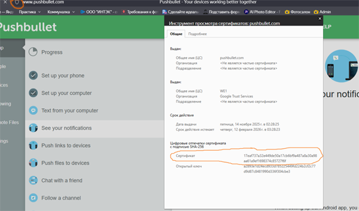

# Push

## PushBullet

_Pushbullet - это интернет-сервис для отправки SMS, управления уведомлениями и отправки файлов между вашими мобильными устройствами и ПК_

[Настройка pushbullet](https://tinkeriot.com/android-push-notifications-esp8266-arduino-tutorial/)

- Установить приложение на телефон
- Зарегистрироваться в [pushbullet](https://www.pushbullet.com)
- Выберите тип вашей мобильной операционной системы (Android или IOS) или зайдите в apps market / Google Play, найдите PushBullet и настройте приложение на своем мобильном устройстве, используя ту же учетную запись, которую вы только что создали. После этого вы должны увидеть свой мобильный смартфон в меню Устройств.
- перейти `Settings` сгенерировать `Create Access Token`

```c++
// Рабочий пример.

// #include <Arduino.h> - может не понадобится
#include <PushbulletAPI.hpp>

const char *pushbullet_key = "x.XXXXXXXXXXXXXXXXXXXXXXXXXXX"; // Access Token Pushbullet
const char *pushbullet_fingerprint = "17eaf737a32e449de50a17cb6bf9a487a8a30a98aa61a9ef1698374c85727f6f";

// You can pass fingerprint verification by using:
// PushbulletAPI pb(pushbullet_key);
// * when using this, is will still connect using ssl but without any certificate verification
// Additionaly, you can set a rule to use only verified connection:
// PushbulletAPI pb(pushbullet_key, pushbullet_fingerprint, true);
// * when using this, if fingerprint is not match to pushbullet certificate it won't connect.
// Or use the basic, with fingerprint but dynamically. So if fingerprint is not match it will set a warning in seiral port but still push messages throw pushbullet.
PushbulletAPI pb(pushbullet_key, pushbullet_fingerprint);

void setupPushBullet()
{
   pb.pushNotifcation("Hello from ESP8266!", "Hello World!");
```

pushbullet_fingerprint

- отключить антивирус
- кликнуть по значку 'соединение защищено' сайта -> безопасное подключение -> действительный сертификат -> подробнее


